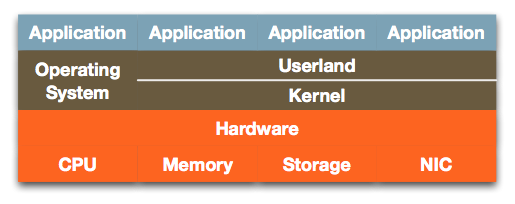
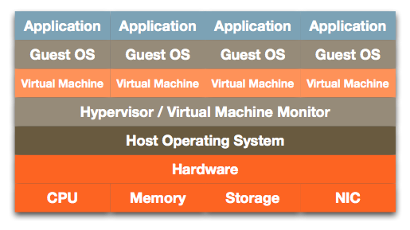
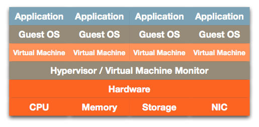
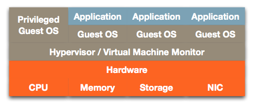
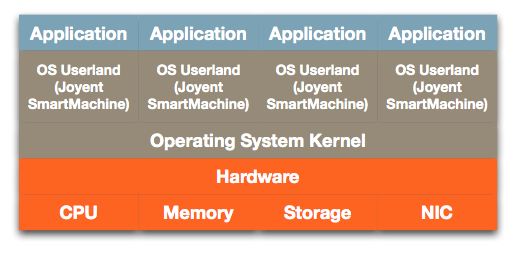
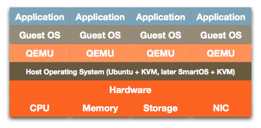

# SmartOS虚拟化---对比
## 1.非虚拟化计算机

**底层显示系统的硬件资源：CPU，内存，存储，NIC(网络)**

**操作系统直接在硬件上运行，并具有两个组件：**

    内核（kernel）：管理系统资源以及这些资源与系统上运行的（在Userland中）应用程序之间的通信。
    userland：运行用户应用程序和软件库的软件层。
    

**出于以下原因，数据中心通常通常每台服务器运行一个应用程序：**

+ 特定于应用程序的要求，其实就是按照软件的环境依赖，需要特定的版本，补丁等
+ 应用程序冲突：某些应用程序彼此不兼容。
+ 资源争用：频繁使用的应用程序不能挤占其他应用程序（如果它们位于单独的计算机上）。
+ 安全性：隔离可防止针对一个系统的攻击损害另一个系统。
+ 弹性：应用程序崩溃不会导致其他应用程序崩溃。
+ 维护：您可以升级和重新引导一个系统而不会影响其他系统。
+ 业务需求：许多企业IT项目都涉及启动特定的应用程序。出于预算和管理的原因，每个项目可能都有自己的服务器和应用程序

**缺点**

    对设备，设施，电源和IT管理资源的非常低效的使用。虚拟化作为解决方案脱颖而出。
 
 ## 2.托管虚拟化
 
 **定义**
 
    在托管虚拟化中，运行在标准操作系统之上的虚拟机监控程序可模拟真实硬件以创建和管理一个或多个虚拟机。（类似VMbox）
**优点**

+ 负载均衡
+ 备份，迁移，克隆
+ 灾难恢复

**缺点**

+ 为了在物理硬件上执行工作，应用程序必须经过两个操作系统和两组硬件。
+ 这些硬件中的一组是“仿真硬件”：一种像硬件一样工作的软件程序，它比真实硬件要慢得多
## 3.裸机硬件虚拟化

**定义**

    裸机虚拟化通过合并虚拟机管理程序和主机操作系统来解决其中的一些低效率问题。主机操作系统被简化为虚拟机监视器-仅运行虚拟机监控程序所需的虚拟机监视器。为此目的对其进行了优化，并将管理程序嵌入其中。（仅将用户领域简化为虚拟化供应商的工具。） 
**缺点**

+ 仍然使用硬件仿真（慢）。
+ 系统管理程序可能需要自己的硬件驱动程序  

## 4.半虚拟化

    半虚拟化类似于裸机虚拟化，但是它删除了虚拟机硬件仿真。
**优点**

+ 非常高效–没有主机OS，没有硬件仿真（这意味着没有OS调用的运行时二进制翻译）。
+ 像托管虚拟化一样，裸机虚拟化可以使用特权客户机已安装的任何设备驱动程序。系统管理程序不包含任何设备驱动程序。

**缺点**

+ 这些修改在可能的情况下（可访问源代码）在内核中完成，或者通过在操作系统中安装系统工具来完成。

## 5.操作系统虚拟化

**优点**

+ 非常高效–无需重复资源。
+ 服务器上只有一个内核副本
+ 每个区域都有其自己的用户区（文件系统，系统库，网络配置，进程表
+ 没有硬件仿真。
+ 利用OS调度程序：应用程序可以在需要时跨系统资源“爆发”
+ 补丁和升级会自动传播到所有容器；无需单独管理和升级各种操作系统。

**缺点**

+ 所有操作环境都相同；您不能运行具有不同版本和补丁程序级别的不同操作系统。

## 6.HVM和OS虚拟机

    SmartOS提供两种类型的硬件虚拟化：KVM和Bhyve。每个都提供硬件仿真，并且是VMM（虚拟机监视器）。
    
**主要功能**
    
    1.SmartOS利用Zones，这是一种加固的容器运行时环境，不依赖VM主机来确保安全性。获得专利的资源保护隔离了容器，并确保每个容器都能公平分配I/O。
    2.SmartOS消除了与VM主机相关的解决方案相关的复杂性。内置网络为每个容器提供一个或多个网络接口，因此每个容器具有完整的IP堆栈，从而消除了端口冲突并简化了网络管理。
    3.每个容器的安全，隔离，可调整大小的文件系统! SmartOS利用ZFS从VM主机依赖项中释放容器存储。ZFS存储虚拟化可轻松实现安全的存储管理，同时实现最高性能。
    4.通过消除虚拟化层并直接在裸机上运行容器，应用程序可享受最高的性能。而且，由于您在OS虚拟容器上运行，因此可以轻松地上下扩展应用程序和基础架构。